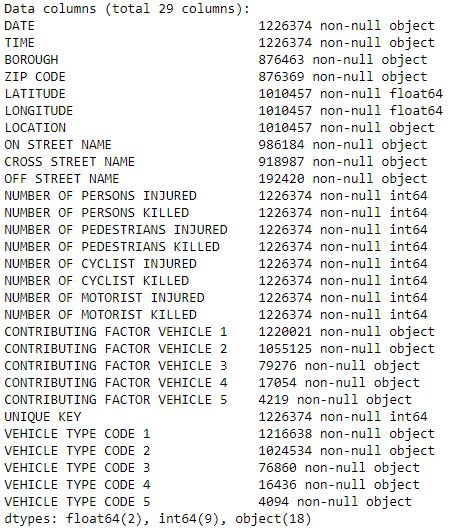
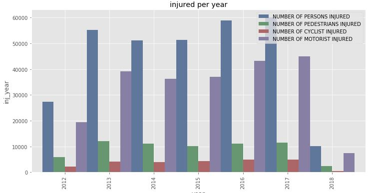
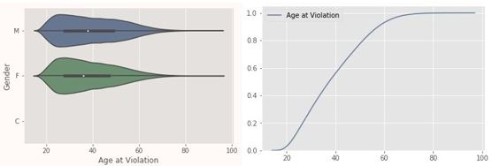
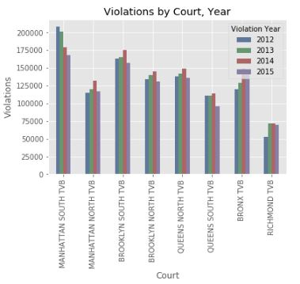
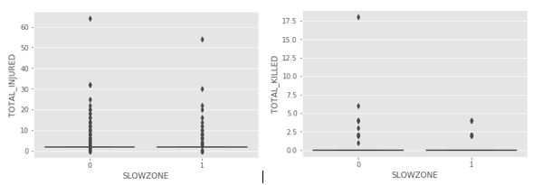
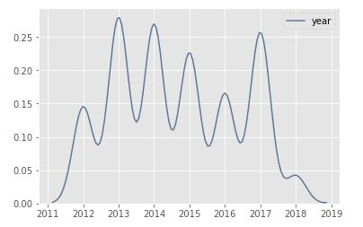

```{r setup, include=FALSE}
knitr::opts_chunk$set(warning=FALSE, message=FALSE, echo=FALSE)
knitr::opts_chunk$set(tidy.opts=list(width.cutoff=80),tidy=TRUE)
options(scipen=999)
```

```{r, results='hide'}
if (!require("devtools",character.only = TRUE)) (install.packages("devtools",dep=TRUE))
if (!require("yaml",character.only = TRUE)) (install.packages("yaml",dep=TRUE))
if (!require("rprojroot",character.only = TRUE)) (install.packages("rprojroot",dep=TRUE))
if (!require("knitcitations",character.only = TRUE)) (install.packages("knitcitations",dep=TRUE))
if (!require("RefManageR",character.only = TRUE)) (install.packages("RefManageR",dep=TRUE))
if (!require("scales",character.only = TRUE)) (install.packages("scales",dep=TRUE))
```

```{r , load libraries}
library(knitcitations)
library(RefManageR)
library(devtools)
library(yaml)
library(papaja)
library(rprojroot)
library(triangle)
library(ggplot2)
library(gridExtra)
library(dplyr)
library(reshape)
library(scales)
```


```{r bib-data, echo=FALSE}
UOI <- bibentry(bibtype="Misc",
                 publisher="University of Iowa",
                 author=personList(person(family="Yuan", given="Zhuoning"),person(family="Zhou", given="Xun"),person(family="Yang", given="Tianbao")),
                 title="Predicting Traffic Accidents Through Heterogeneous Urban Data",
                 year=2017,
                 url="http://urbcomp.ist.psu.edu/2017/papers/Predicting.pdf")


ScienceDirect <- bibentry(bibtype="Article",
                 author=personList(person(family="Chang", given="Li-Yen"), 
                                   person(family="Chen", given="Wen-Chieh")
                                    ),
                 title="Data mining of tree-based models to analyze freeway accident frequency",
                 year=2005,
                  journal = "Science Direct",
                 url="https://www.sciencedirect.com/science/article/pii/S0022437505000708")
   
  
UOC <- bibentry(bibtype="Misc",
                 publisher="University of California",
                 author=personList(person(family="Eisenberg", given="Daniel")),
                 title="The mixed effects of precipitation on traffic crashes",
                 year=2004,
                 url="https://www.ncbi.nlm.nih.gov/pubmed/15094418")

TANDF <- bibentry(bibtype="Article",
                 author=personList(person(family="Jackson", given="Terrance"), 
                                   person(family="Sharif", given="Hatim")
                                    ),
                 title="Rainfall impacts on traffic safety: rain-related fatal crashes in Texas",
                 year=2005,
                 journal = "TandF",
                 url="https://www.tandfonline.com/doi/full/10.1080/19475705.2014.984246?src=recsys")
 
```

# Abstract

This paper investigates the factors associated with traffic violations and accidents in NYC and reviews the results of the *Vision Zero* plan, a program created in 2014 in an attempt to prevent the traffice incidents in NYC. Today in New York, approximately 4,000 New Yorkers are seriously injured and more than 250 are killed each year in traffic crashes. Being struck by a vehicle is the leading cause of injury-related death for children under 14, and the second leading cause for seniors. On average, vehicles seriously injure or kill a New Yorker every two hours.The Vision Zero Action Plan is the City's foundation for ending traffic deaths and injuries on our streets.
  

# Keywords

"traffic tickets, motor vehicle collission, vision zero, arterial slow zones, pedestrian"


# Introduction

 In an effort to reduce traffic fatalities and injuries, NYC released the Vision Zero Action Plan in 2014. The Vision Zero action plan included many initiatives but one of the more known initiative was reducing the citywide speed limit from 30 mph to 25 mph. How effective was reduction of the speed limit at lowering injuries and fatalities? Does reducing the speed limit actually decrease the number of motor vehicle accidents and/or traffic violations? As more traffic violations can lead to increased accidents, can we identify traffic hot spots (areas with recurring traffic violations)? In this study, we would plan on applying data mining algorithms like K-means and SVD to identify clusters in the data.

Additionally, as part of this study,  we would like to answer several secondary questions, such as:  

  * Who are involved in majority of the traffic violations?
  * What are the key contributing factors to the traffic accidents?
  * Where are the hot spots? Can we identify locations with excessive number of crashes of a particular type?
  * When is the majority of the traffic incidents occur?
  * Why are some locations more prone to accidents than others?
  * How can we prevent traffic accidents from occurring?

We believe this research would help provide valuable insights into the effectiveness of the Vision Zero's intended goal of eliminating injuries and fatalities from motor vehicle accidents.

# Literature Review

 We have reviewed few articles, news items, journal papers related to the traffic incidents and factors causing the collisions. The research paper `r citep(UOI)` analysed motor vehicle crashes from 2006 to 2013 in the state of Iowa, and tried to predict whether an accident will occur , for each road segment in each hour. The journal article `r citep(ScienceDirect)` focused on the data mining of tree-based models to analyze freeway accident frequency, leveraging the CART model and a negative binomial regression model.The research `r citep(UOC)` study investigates the relationship between monthly precipitation and monthly fatal crashes, using the negative binomial regression approach. We also reviewed the journal article `r citep(TANDF)` which focuses on the impacts of the rainfall on traffic safety in Texas, by analysing the relationship between crashes and rainfall.
 


# Methodology 

## Data Exploration 
The datasets we used for this analysis are from publicly available data from NYPD motor vehicle collission, which is a breakdown of every collision in NYC by location and injury, and *traffic tickets* data from NY data site. We plan to get various *vision zero* datasets  from NYC vision zero datafeeds.As part of the data exploration, we will perform *Exploratory data analysis* to better understand the relationships in the given data including feature distributions,correlations and basic summary statistics. We also plan to identify the outliers, missing data and any look for invalid data.


## Data Preparation 
As part of the data preparation, we plan to fix the data issues noticed in the exploratory analysis, which involves treating the outliers, missing data, invalid data etc. We also plan to identify the data classifications, and create dummy variables wherever required, and will convert the categorical data to numeric data which would help us later in model building.


## Model Development 
Our primary objective here is to investigate the factors associated with the traffic incidents and understand how effective is *vision zero* initiative. We would also be interested in identifying the hot spots using the clustering methods like K-Means, Hierarchical clustering.


## Model Validation 

<TBD>


# Experimentation and Results 

## Data Exploration and Preparation 

The below are the data sets we use to explore the NYC traffic incidents.

**Dataset**  

[NYC Traffic Tickets](https://github.com/psumank/DATA698/raw/master/Data/Traffic_Tickets_Issued__NYC.zip)  
[NYC Motor Vehicle Collision](https://github.com/psumank/DATA698/raw/master/Data/NYPD_Motor_Vehicle_Collisions.zip)  
[Vision Zero](http://www.nyc.gov/html/dot/html/about/vz_datafeeds.shtml) 


__NYC Accidents:__



There are 1226374 observations from the collision dataset.

By grouping the accidents by borough and year, we can see the accident counts in each borough of NYC by year, as shown in fig. *Accidents by borough* :


Plotted the injuries by year by combining all injuries 'NUMBER OF PERSONS INJURED','NUMBER OF PEDESTRIANS INJURED','NUMBER OF CYCLIST INJURED','NUMBER OF MOTORIST INJURED':




The fatalities plot (which include all of 'NUMBER OF PERSONS KILLED','NUMBER OF PEDESTRIANS KILLED','NUMBER OF CYCLIST KILLED','NUMBER OF MOTORIST KILLED') shows the fatalities by year.


From the above plots, the fatalities appears to be slightly decreased after 2014, however no such indication in case of injuries. So, there is no clear indication if the *vision zero* is the cause for the above reduction in fatalities. We need to further evalulate the same with specific vison zero data feeds.


__NYC Traffic Violations:__ 

Here, we would like to briefly explore the traffic tickets dataset. NYC Violation data consists of the variables: 'Violation Charged Code', 'Violation Description', 'Violation Year', 'Violation Month', 'Violation Day of Week', 'Age at Violation','Gender', 'State of License', 'Police Agency', 'Court', 'Source'. There are approximately half million violation records during the years 2012-16.

By looking at what age group may be causing more violations, its evident that over 50% of the violations happened in the age group below 35 years.




Grouping violations by Courts in NYC from traffic tickets data, we see that there is a slight reduction of violations post vision zero initiative across all boroughs. As you can see here, Manhattan has the most traffic violations.




### Vision Zero Analysis

As part of our *vision zero data feeds* analysis, we will have a closer look at some specific areas and investigate if there is a change after a specific vision zero initiative.

__Pedestrian Incident Analysis:__ 

We have extracted the pedestrians and cyclists injuries and fatalities from the collision data and treated that as our pedestrian incident dataset, during the years 2012-2018.


Looking at the pedestrian incidents plot, its not showing a decrease in the incidents over the years. Also, the majority of the incidents are happening towards the later part of the day(between 3 to 4 PM), and slightly more chance on Fridays. When we looked at overall incidents acoross all months over these years, the October month has majority of the incidents.

We will try gathering the specific vision zero initative ( for example, *arterial slow zones* ) and analyse if there is any pattern before and after the initiative.

The *Arterial Slow Zone program* uses a combination of a lower speed limit, signal timing changes, distinctive signs and increased enforcement to improve safety on some of New York
City's most high-crash corridors. The slow zone geo json data is available [here](http://www.nyc.gov/html/dot/downloads/misc/arterial_slow_zones.json)
We load the slow zone geo json data, and add a feature *SLOWZONE* to our pedestrain dataset by comparing if the incident point from the pedestrian dataset falls near the arterial slow zone or not. If the incident happend near the *SLOWZONE*, then we will mark it as 1, else 0.



There is clear reduction in the incidents in slow zones when compared with non-slow zone areas.

Taking only slowzone areas and plotting incidents year over year produced mixed results, there was a significant reduction immediately following the vision zero initiative, however, the incidents shooted up again in the year 2017!




\newpage

## Model Development  

### Model 1 


### Model 2  


## Model Validation 


\newpage


# Conclusion 


# References


```{r bib-references, results='asis', echo=FALSE, message=FALSE}
BibOptions(style="html", bib.style="authortitle")
bibliography()
```


